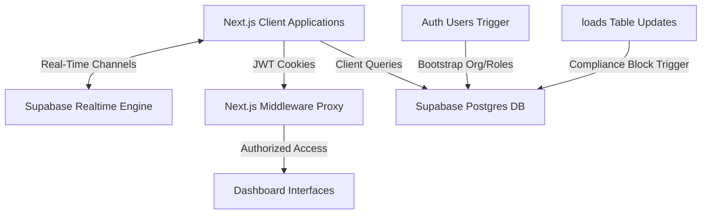

# System Architecture — LoadFlow

LoadFlow is built as a serverless, real-time freight brokerage operations suite. The tech stack utilizes Next.js for the application container and Supabase for the database, real-time synchronization, and authentication backend.

---

## 🏗️ High-Level Design

### 1. Frontend: Next.js App Router (React Client Components)
- Portals are organized logically by role directories inside `src/app/dashboard/`:
  - `/dashboard/broker`: Brokerage operations overview, compliance auditing, system logs, and load creation.
  - `/dashboard/carrier`: Fleet dispatch overview, available load board bidding, compliance uploads, and digital contract signing.
  - `/dashboard/shipper`: Shipper request form and real-time cargo tracking timeline.
- The theme utilizes Vanilla TailwindCSS and Lucide React icons for styling.

### 2. Backend: Edge Route Proxy Middleware
- Decouples role-based authorization checking from DB access by reading metadata embedded directly in Next.js cookie JWT payloads via `src/proxy.ts`.
- Blocks cross-portal access (e.g., carrier trying to query broker dashboards) at the edge, bailing out with a warning redirection banner.

### 3. Serverless Integration: Supabase
- **Authentication**: Direct client-side user creation and session validation via `@supabase/ssr`.
- **Real-Time Engine**: Portals subscribe to target PostgreSQL channels (`loads`, `bids`, `carrier_compliance`) to synchronize listings dynamically without polling.
- **Database Trigger Functions**: Business rules are written as SQL functions and triggers directly in Postgres, guaranteeing data constraints independently of the client.
