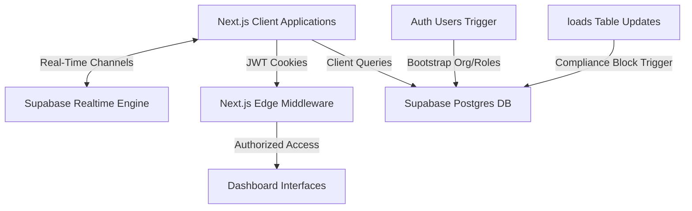

# System Architecture & Development Onboarding — LoadFlow

LoadFlow is built as a real-time, multi-tenant freight brokerage operations platform. This document outlines the technological stack, local setup, edge middleware routing, and real-time syncing system.

---

## 🏗️ High-Level Design & Component Flow



### 1. Frontend: Next.js App Router (React Client Components)
- Next.js **App Router** is utilized with absolute path aliases (`@/*`).
- Styling is implemented using **Vanilla TailwindCSS** and **shadcn/ui** components.
- Portals are organized logically by role directories inside `src/app/dashboard/`:
  - `/dashboard/broker`: Brokerage operations overview, compliance auditing, system logs, and load creation.
  - `/dashboard/carrier`: Fleet dispatch overview, available load board bidding, compliance uploads, and digital contract signing.
  - `/dashboard/shipper`: Shipper request form and real-time cargo tracking timeline.

### 2. Backend: Edge Route Proxy Middleware
- Decouples role-based authorization checking from DB access by reading metadata embedded directly in Next.js cookie JWT payloads via `src/proxy.ts`.
- Blocks cross-portal access (e.g., carrier trying to query broker dashboards) at the edge, bailing out with a warning redirection banner.

### 3. Serverless Integration: Supabase
- **Authentication**: Direct client-side user creation and session validation via `@supabase/ssr`.
- **Real-Time Engine**: Portals subscribe to target PostgreSQL channels (`loads`, `bids`, `carrier_compliance`) to synchronize listings dynamically without polling.
- **Database Trigger Functions**: Business rules are written as SQL functions and triggers directly in Postgres, guaranteeing data constraints independently of the client.

---

## ⚙️ Environment Configuration & Directory Tree

### Required Environment Variables (`.env.local`)
Create a `.env.local` file in the project root:
```env
NEXT_PUBLIC_SUPABASE_URL="https://your-project-ref.supabase.co"
NEXT_PUBLIC_SUPABASE_ANON_KEY="your-anon-public-key"
```

### Key Folder Structures
```
├── dev docs/               # Developer documentation (.md files)
├── src/
│   ├── app/                # Next.js App Router folders
│   │   ├── api/            # Secure route handlers (/api/staff/invite, /api/loads/override-compliance)
│   │   ├── dashboard/      # Role-scoped dashboard folders (broker, carrier, shipper)
│   │   ├── login/          # Auth login page
│   │   ├── signup/         # Multi-tenant invite-aware signup page
│   │   └── layout.tsx      # Main layout wrapper
│   ├── components/         # Reusable shadcn/ui components (DashboardShell, UI controls)
│   ├── lib/
│   │   ├── supabase.ts     # Supabase client instances (browser client & server SSR client)
│   │   └── mockData.ts     # TypeScript interfaces and local mock templates
│   └── proxy.ts            # Next.js route proxy middleware
└── supabase/
    └── migrations/         # PostgreSQL schema migration files
```

---

## 💻 Local Setup & Execution

### 1. Install Dependencies
```bash
npm install
```

### 2. Run in Development Mode
```bash
npm run dev
```
Open [http://localhost:3000](http://localhost:3000) to view the application in the browser.

### 3. Build & Compile Checks
Verify full static compilation and type compliance:
```bash
npm run build
```
The Next.js build output separates static routes from server-rendered endpoints (`ƒ` dynamic / route proxy).
