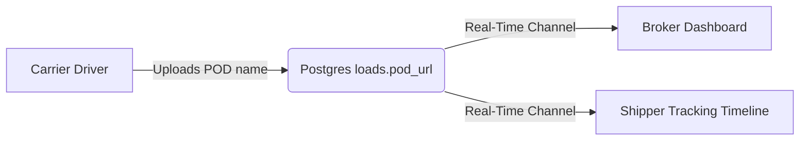

# Proof of Delivery (POD) Tracking — LoadFlow

Proof of Delivery (POD) documents certify that cargo has arrived successfully at the destination, triggering broker payments.

---

## 📦 POD Tracking Flow



### 1. Carrier Upload
- Carrier drivers can upload Proof of Delivery document names or URLs directly inside active dispatches in `/dashboard/carrier` once status moves past `booked`.
- Entering a filename and clicking "Upload" updates the load's `pod_url` column in the database.

### 2. Broker View
- In `/dashboard/broker/loads`, the load details panel displays a dedicated **Proof of Delivery (POD)** card showing the uploaded document name.

### 3. Shipper Timeline
- In `/dashboard/shipper`, the tracking timeline displays the uploaded POD document link next to the "Delivered at Destination" milestone, providing immediate visibility to shippers.

---

## 💻 Code & Real-Time Sync Subscriptions

### 1. Client Upload Action (Carrier dashboard)
Located in [carrier/page.tsx](file:///Users/apple/Freight-Brokerage-Operations/src/app/dashboard/carrier/page.tsx):
```typescript
const handleUploadPod = async (loadId: string, podName: string) => {
  const load = loads.find(l => l.id === loadId);
  if (!load || !(load as any).db_id) return;

  const { error } = await supabase
    .from("loads")
    .update({ pod_url: podName })
    .eq("id", (load as any).db_id);

  if (error) {
    alert("Error uploading POD: " + error.message);
  } else {
    alert("POD uploaded successfully!");
  }
};
```

### 2. Real-Time Channel Subscription (Broker/Shipper pages)
Real-time listeners subscribe to the database table channel to pick up changes without manual page refreshes:
```typescript
useEffect(() => {
  const channel = supabase
    .channel("realtime-loads")
    .on(
      "postgres_changes",
      { event: "*", schema: "public", table: "loads" },
      (payload) => {
        // Trigger page re-fetch or state update
        fetchLoads();
      }
    )
    .subscribe();

  return () => {
    supabase.removeChannel(channel);
  };
}, []);
```
Whenever a carrier inputs a POD file, the update broadcasts to the broker and shipper instantly, shifting their tracking displays.
