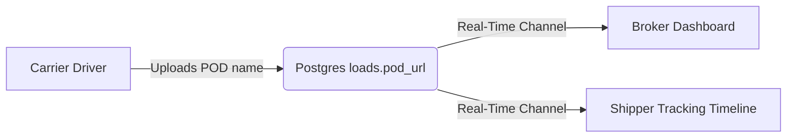

# Proof of Delivery (POD) Tracking

Proof of Delivery (POD) documents certify that cargo has arrived successfully at the destination, triggering broker payments.

---

## 📦 POD Tracking Flow

### 1. Carrier Upload
- Carrier drivers can upload Proof of Delivery document names or URLs directly inside active dispatches in `/dashboard/carrier` once status moves past `booked`.
- Entering a filename and clicking "Upload" updates the load's `pod_url` column in the database.

### 2. Broker View
- In `/dashboard/broker/loads`, the load details panel displays a dedicated **Proof of Delivery (POD)** card showing the uploaded document name.

### 3. Shipper Timeline
- In `/dashboard/shipper`, the tracking timeline displays the uploaded POD document link next to the "Delivered at Destination" milestone, providing immediate visibility to shippers.
