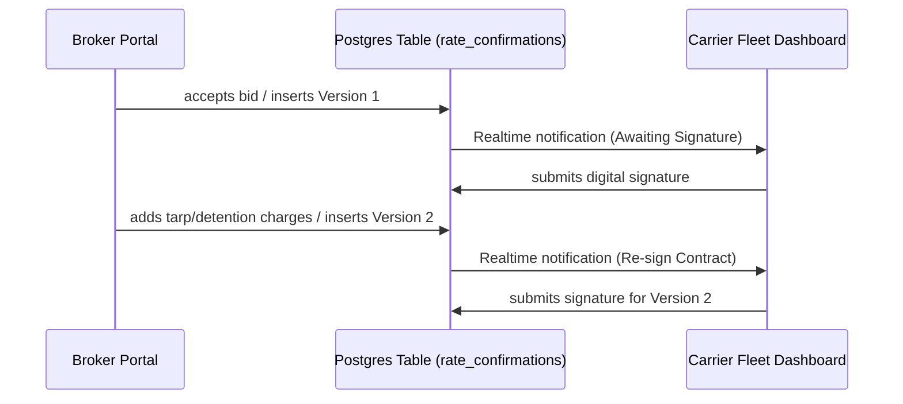

# Digital Rate Confirmations & Accessorials

LoadFlow implements digital contracting using versioned rate agreements. This separates cargo details from negotiations and accessorial adjustments.

---

## 📝 versioning Workflow

### 1. Version Creation
- When a Broker accepts a carrier bid, the transaction inserts the initial contract row (`version = 1`, `status = 'pending_signature'`) in the `rate_confirmations` table.
- Brokers can append accessorials (Tarp, Detention, Layover) on the Load detail panel. Submitting inserts a new row (`version = current_max + 1`, `status = 'pending_signature'`).

### 2. Carrier Digital Sign-off
- The Carrier Fleet page reads the latest version from `rate_confirmations` for the load.
- If the latest version's status is `pending_signature`, the carrier is shown a "Sign Rate Confirmation" button.
- Signing updates both the `rate_confirmations` row (`status = 'signed'`) and the `loads` table (with signature details).
- Previous signed versions are retained in the database as an immutable history of negotiations.
