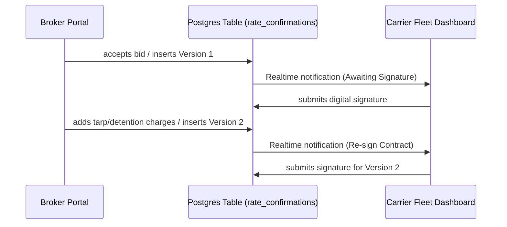

# Digital Rate Confirmations & Accessorials — LoadFlow

LoadFlow implements digital contracting using versioned rate agreements. This separates cargo details from negotiations and accessorial adjustments.

---

## 📝 versioning Workflow



### 1. Version Creation
- When a Broker accepts a carrier bid, the transaction inserts the initial contract row (`version = 1`, `status = 'pending_signature'`) in the `rate_confirmations` table.
- Brokers can append accessorials (Tarp, Detention, Layover) on the Load detail panel. Submitting inserts a new row (`version = current_max + 1`, `status = 'pending_signature'`).

### 2. Carrier Digital Sign-off
- The Carrier Fleet page reads the latest version from `rate_confirmations` for the load.
- If the latest version's status is `pending_signature`, the carrier is shown a "Sign Rate Confirmation" button.
- Signing updates both the `rate_confirmations` row (`status = 'signed'`) and the `loads` table (with signature details).
- Previous signed versions are retained in the database as an immutable history of negotiations.

---

## 💻 TypeScript Implementation Code

### 1. Publishing a New Rate Agreement Version (Broker side)
Located in [loads/page.tsx](file:///Users/apple/Freight-Brokerage-Operations/src/app/dashboard/broker/loads/page.tsx):
```typescript
const handleIssueRateConfirmation = async (e: React.FormEvent) => {
  e.preventDefault();
  if (!activeSelectedLoad || !activeSelectedLoad.db_id) return;

  const tarp = Number(tarpCharge) || 0;
  const detention = Number(detentionCharge) || 0;
  const layover = Number(layoverCharge) || 0;
  const grandTotal = activeSelectedLoad.rate + tarp + detention + layover;
  const nextVer = rateConfirmations.length + 1;

  const { error } = await supabase
    .from("rate_confirmations")
    .insert({
      load_id: activeSelectedLoad.db_id,
      version: nextVer,
      rate: activeSelectedLoad.rate,
      tarp_charge: tarp,
      detention_charge: detention,
      layover_charge: layover,
      grand_total: grandTotal,
      status: "pending_signature"
    });

  if (!error) {
    setIsIssuingVersion(false);
    setTarpCharge("0");
    setDetentionCharge("0");
    setLayoverCharge("0");
  }
};
```

### 2. Digital Signature Submission (Carrier side)
Located in [carrier/page.tsx](file:///Users/apple/Freight-Brokerage-Operations/src/app/dashboard/carrier/page.tsx):
```typescript
const handleSignContract = async (e: React.FormEvent) => {
  e.preventDefault();
  if (!signingLoad || !(signingLoad as any).db_id) return;

  // 1. Mark latest versioned contract as signed
  if (latestRateConfirmation) {
    await supabase
      .from("rate_confirmations")
      .update({
        status: "signed",
        carrier_signature: signatureName,
        signed_at: new Date().toISOString()
      })
      .eq("id", latestRateConfirmation.id);
  }

  // 2. Mark the parent load as signed
  const { error } = await supabase
    .from("loads")
    .update({
      carrier_signature: signatureName,
      signed_at: new Date().toISOString()
    })
    .eq("id", (signingLoad as any).db_id);
};
```
Notice that previous versions remain intact and unsigned, creating an auditable paper trail.
